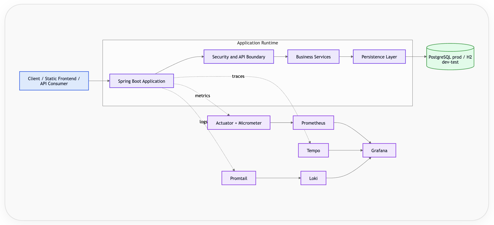
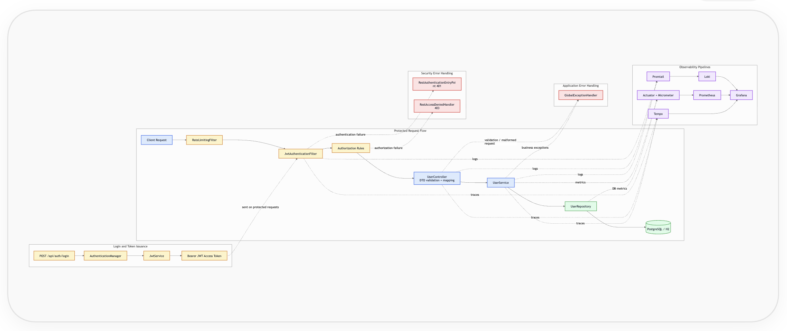

# User Management Service

<p align="center">
  <strong> Secure user management • Stateless authentication • End-to-end observability</strong>
</p>

<p align="center">
  A backend system designed with clear layering, strong security boundaries and production-grade operational visibility
</p>

<br/>

<p align="center">
  <code>Spring Boot</code> ·
  <code>PostgreSQL</code> ·
  <code>JWT</code> ·
  <code>Flyway</code> ·
  <code>Prometheus</code> ·
  <code>Grafana</code> ·
  <code>Tempo</code> ·
  <code>Loki</code>
</p>

<br/>

<p align="center">
  <a href="#quick-start"><strong>Quick Start</strong></a> •
  <a href="#architecture-overview"><strong>Architecture</strong></a> •
  <a href="#api-contract"><strong>API</strong></a> •
  <a href="#production-readiness"><strong>Production</strong></a>
</p>

---

> **What this project demonstrates**  
> A production-oriented backend architecture focusing on security, system design, and operational readiness that goes beyond CRUD 

---

## Table of Contents

<details>
<summary><strong>View all sections</strong></summary>

**Getting Started**
- [Quick Start](#quick-start)
- [Overview](#overview)
- [Key Highlights](#key-highlights)

**Architecture**
- [Architecture Overview](#architecture-overview)
- [High-Level Design (HLD)](#high-level-design-hld)
- [Low-Level Design (LLD)](#low-level-design-lld)
- [Key Architectural Decisions](#key-architectural-decisions)
  - [System framing](#system-framing)
  - [Request flow (conceptual)](#request-flow-conceptual)
  - [Layer mapping](#layer-mapping)
  - [Cross-cutting concerns](#cross-cutting-concerns)
  - [HLD Component Design Guide](#hld-component-design-guide)
  - [LLD Component Design Guide](#lld-component-design-guide)

**Setup & Usage**
- [Prerequisites](#prerequisites)
- [Run Locally](#run-locally)
- [API Contract](#api-contract)
- [Engineering Contracts](#engineering-contracts)
  - [Authentication](#authentication)
  - [Create User](#create-user)
  - [Validate Credentials](#validate-credentials)
  - [Get User Profile](#get-user-profile)

**Security & Configuration**
- [Secrets Management](#secrets-management)
- [Environment Configuration](#environment-configuration)
- [Security Model](#security-model)

**Observability & Quality**
- [Observability Details](#observability-details)
- [Testing Strategy](#testing-strategy)
- [Test Sequence Map](#test-sequence-map)
- [CI/CD Pipeline](#cicd-pipeline)

**Design & Governance**
- [Design Decisions](#design-decisions)
- [Scalability Considerations](#scalability-considerations)
- [Trade-offs](#trade-offs)
- [Non-Goals](#non-goals)
- [Repository Governance](#repository-governance)

**Roadmap & Ops**
- [Production Readiness](#production-readiness)
- [Production Readiness Evidence](#production-readiness-evidence)
- [Project Structure](#project-structure)
- [Troubleshooting](#troubleshooting)
- [Future Roadmap](#future-roadmap)

</details>

## Quick Start

```bash
git clone https://github.com/<your-username>/user-management-service.git
cd user-management-service
cp .env.example .env
docker compose up --build
```

Ensure Docker is running before starting the stack.

### Access the application

| Service | URL |
|---|---|
| App | http://localhost:8080 |
| Grafana | http://localhost:3000 |

## Overview

This service provides:

- User registration with hashed password storage
- Credential validation and JWT-based authentication
- Stateless access control for protected endpoints
- Secure retrieval of user profile data

It is implemented as a layered monolith with strong emphasis on security, observability and maintainability, making it suitable for production deployment and scalable growth.

## Key Highlights

Core capabilities and system strengths.

- JWT-based authentication and protected endpoint access control
- Built-in observability across metrics, logs and tracing
- Multi-layer testing strategy covering unit, integration and contract checks
- Deployment-oriented runtime, persistence and security configuration

---

### Architecture

> System structure, layering and cross-cutting concerns

> **Key Idea:**  
> The system prioritizes layered separation and stateless authentication to keep scaling and operational control straightforward.

> **Architecture Summary**
>
> - **System style:** layered monolith
> - **Auth model:** stateless JWT authentication
> - **Persistence:** JPA/Hibernate + Flyway-managed schema
> - **Runtime profiles:** PostgreSQL for production, H2 for development/testing
> - **Observability:** metrics, logs and traces wired to Prometheus, Grafana, Loki and Tempo
> - **Security posture:** least-privilege DB access, destructive methods denied, request guardrails enforced

The system follows a layered monolith approach:

- Request entry through security and API boundary
- Business logic handled in service layer
- Persistence isolated via repository layer
- Observability emitted across all layers

### System framing

- **System type**: Layered monolith backend with stateless JWT authentication and a static frontend
- **Primary responsibilities**: User registration, credential validation, authenticated profile access and operational observability

### Request flow (conceptual)

Client → Application → Security Boundary → Services → Persistence → Database

### Layer mapping

- **Application**: Spring Boot runtime hosting REST controllers and static frontend
- **Security Boundary**: security filters, authentication, authorization and rate limiting
- **Services**: domain and business logic layer
- **Persistence**: repository layer backed by JPA/Hibernate

### Cross-cutting concerns

- Security (JWT authentication, authorization, rate limiting)
- Observability (logging, metrics, tracing)
- Error handling (centralized exception mapping)

Detailed runtime structure and request lifecycle are described in the HLD and LLD sections below.

---

## High-Level Design (HLD)

> Runtime components, boundaries and observability pipelines

> **Key Idea:**  
> Runtime boundaries remain explicit so security, data access and observability can evolve independently.

The HLD captures the major runtime components, their boundaries and the supporting observability stack.

### Responsibilities

- Stateless authentication and secure API boundary controls
- User management, authentication and authorization enforcement
- Repository-backed persistence with Flyway-managed schema
- Cross-cutting observability across metrics, logs and traces

### Flow

Client → Application → Security Boundary → Services → Persistence → Database

### Guarantees

- Security enforcement through layered boundary checks and policy controls
- Observability coverage through metrics, logs and tracing pipelines
- Separation of concerns across application, security boundary, services, persistence and database

### Diagram

Runtime structure:



*Figure: High-Level Design showing runtime layers and observability pipelines.*

### HLD Component Design Guide

| Component | Represents | Best shape/icon style | Recommended label |
|---|---|---|---|
| Client | External user or API consumer | Actor/user node | `Client / API Consumer` |
| Application | Runtime container serving frontend and APIs | Application/server node | `Application` |
| Security boundary | Request entry controls (authentication, authorization, HTTP boundary) | Shield + endpoint group | `Security Boundary` |
| Services | Domain orchestration and business rules | Service/gear group | `Services` |
| Persistence | Repository-backed data access | Storage/repository group | `Persistence` |
| Database | Backing datastore | Database cylinder | `PostgreSQL / H2` |
| Observability stack | Metrics, traces and logs pipeline | Monitoring/logging group | `Prometheus`, `Grafana`, `Tempo`, `Promtail`, `Loki` |

---

## Low-Level Design (LLD)

> Request lifecycle, authentication flow and error handling paths

The LLD captures the request lifecycle for authentication and protected access, including authorization, validation, persistence, error handling and observability hooks.

### Login and token issuance

- `POST /api/auth/login` validates credentials via `AuthenticationManager`
- `JwtService` issues a signed JWT access token

### Protected request handling

- `RateLimitingFilter` enforces per-client request throttling
- `JwtAuthenticationFilter` validates JWTs for protected endpoints
- Authorization rules enforce:
  - restriction of destructive HTTP methods (`DELETE`, `PUT`, `PATCH`)
  - user-level access control (token subject must match requested resource)
- `UserController` validates DTOs and delegates to `UserService`
- `UserMapper` (MapStruct) performs DTO ↔ entity transformation
- `UserService` applies business rules and normalization
- `UserRepository` performs persistence operations

### Error handling

- `GlobalExceptionHandler` normalizes validation and business errors into consistent API responses
- `RestAuthenticationEntryPoint` handles authentication failures (`401`)
- `RestAccessDeniedHandler` handles authorization failures (`403`)

### Observability

- Metrics via Actuator + Micrometer → Prometheus → Grafana
- Traces via OpenTelemetry → Tempo → Grafana
- Logs via structured application logging → Promtail → Loki → Grafana

### Diagram

Request lifecycle:



*Figure: Low-Level Design showing authentication, protected request flow, error handling and observability pipelines.*

### LLD Component Design Guide

| Component | Represents | Best shape/icon style | Recommended label |
|---|---|---|---|
| Login endpoint | Authentication entry point | Key/auth node | `POST /api/auth/login` |
| AuthenticationManager | Credential validation decision | Security decision node | `AuthenticationManager` |
| JwtService | JWT issue/validate service | Token/key node | `JwtService` |
| JWT filter | Protected endpoint auth check | Filter + shield | `JwtAuthenticationFilter` |
| Authorization rules | Request authorization checks and guardrails | Policy/decision node | `Authorization Rules` |
| Rate limiter | Abuse/throttle checkpoint | Gauge/filter node | `RateLimitingFilter` |
| Controller | API boundary with request validation and mapping | Endpoint/controller node | `UserController` |
| Service | Business rules | Service/gear node | `UserService` |
| Repository | Data access boundary | Storage/repository node | `UserRepository` |
| Database | Persistence store accessed via repository layer | Database cylinder | `PostgreSQL / H2` |
| Application exception handler | Application error normalization | Warning/error node | `GlobalExceptionHandler` |
| Authentication entry point | Security authentication failure handler | Security/error node | `401 AuthenticationEntryPoint` |
| Access denied handler | Security authorization failure handler | Security/error node | `403 AccessDeniedHandler` |
| Observability hooks | Logs, metrics, traces | Monitor/log/trace nodes | `Actuator + Micrometer`, `Tempo`, `Promtail`, `Loki`, `Prometheus` |

---

## Key Architectural Decisions

- Layered monolith architecture for simplicity and maintainability
- Stateless JWT-based authentication for scalability
- Repository-backed persistence with Flyway-managed schema
- Separation of application and migration database users (least privilege)
- Centralized observability stack (metrics, logs, traces)
- Explicit separation of security error handling and application error handling

---

## Prerequisites

- Java 17
- Docker and Docker Compose (required for the full stack and Testcontainers-backed tests)
- Access to set environment variables or `.env` for local runs

## Core Capabilities

### Authentication and Authorization

- JWT-based authentication (`/api/auth/login`)
- Stateless request authentication through Spring Security filters
- User-level access control for profile reads (self-profile only)
- Consistent JSON security error responses (`401`, `403`)

### User Management APIs

- Create user accounts
- Validate submitted credentials
- Retrieve authenticated user profile data

### Security

- Password hashing through Spring Security `PasswordEncoder`
- Explicit deny rules for destructive HTTP methods: `DELETE`, `PUT`, `PATCH`
- JWT secret strength validation (base64 + minimum key length)
- API-level in-memory rate limiting (chosen for low operational overhead in a single-instance setup; Redis is the intended upgrade path for distributed environments)
- Security headers:
  - `Content-Security-Policy`
  - `X-Frame-Options`
  - `Strict-Transport-Security`

### Database and Persistence

- PostgreSQL profile for production
- H2 profile for development and test
- H2 is used for faster local iteration, while production behavior is validated against PostgreSQL
- Flyway schema migrations
- Least-privilege DB runtime user (`app_user`)
- Separate migration and runtime users
- Email indexing for lookup performance
- Soft-delete ready model (`is_active`, `deleted_at`)
- Audit fields (`created_at`, `updated_at`) with JPA auditing

### Observability Details

- Spring Boot Actuator (`health`, `info`, `prometheus`)
- Prometheus metrics scraping
- Grafana dashboards (auto-provisioned)
- Distributed tracing via OpenTelemetry + Tempo
- Log aggregation via Loki + Promtail
- Structured request logging with request-scoped correlation IDs

### Testing and Quality

- Unit tests (service layer)
- Repository tests use PostgreSQL Testcontainers to validate real database behavior beyond in-memory assumptions
- Integration tests (API and security flows)
- Contract tests (API schema validation)
- Rate limiting tests (`429` behavior)
- JaCoCo coverage reports
- End-to-end stack verification script (`verify-stack.sh`)

### CI/CD and Security Scanning

- GitHub Actions pipeline
- CodeQL static analysis
- Dependency vulnerability scanning
- Trivy filesystem and container image scanning

---

### Production & Readiness

> Operational guarantees, safeguards and validation evidence

> **Key Idea:**  
> Production controls are treated as first-class contracts and are tied to concrete verification evidence.

The service includes the following production-oriented controls and operational safeguards:

- Stateless authentication (`JWT`)
- Least-privilege DB access
- Observability (metrics, logs, tracing)
- CI/CD with security scanning
- Input validation and error standardization

### Production Readiness Evidence

The table below maps production-oriented controls to implementation and verification evidence.

| Control | Status | Proof (code/tests) |
|---|---|---|
| Guard clauses (`null`, blank, invalid config) | Implemented | [`UserService`](./src/main/java/com/example/usermanagementservice/service/UserService.java), [`RateLimitingFilter`](./src/main/java/com/example/usermanagementservice/security/RateLimitingFilter.java), [`RequestSizeLimitFilter`](./src/main/java/com/example/usermanagementservice/security/RequestSizeLimitFilter.java), [`UserServiceTest`](./src/test/java/com/example/usermanagementservice/service/UserServiceTest.java), [`FilterGuardrailTest`](./src/test/java/com/example/usermanagementservice/security/FilterGuardrailTest.java) |
| Edge-case categories (`Degenerate`, `Uniform`, `Extremes`, `Adversarial`, `Duplicates`, `Negative values`) | Implemented for this API domain | [`UserControllerIntegrationTest`](./src/test/java/com/example/usermanagementservice/controller/UserControllerIntegrationTest.java), [`FilterGuardrailTest`](./src/test/java/com/example/usermanagementservice/security/FilterGuardrailTest.java), [`RateLimitingIntegrationTest`](./src/test/java/com/example/usermanagementservice/controller/RateLimitingIntegrationTest.java) |
| Input/output contracts + invariants | Implemented and documented | [`Engineering Contracts`](#engineering-contracts), [`API Contract`](#api-contract) |
| Integer overflow protection | Implemented | [`RateLimitingFilter`](./src/main/java/com/example/usermanagementservice/security/RateLimitingFilter.java), [`JwtService`](./src/main/java/com/example/usermanagementservice/security/JwtService.java), [`FilterGuardrailTest`](./src/test/java/com/example/usermanagementservice/security/FilterGuardrailTest.java) |
| Hidden `O(N^2)` / repeated-scan avoidance | Implemented in hot paths | [`RateLimitingFilter`](./src/main/java/com/example/usermanagementservice/security/RateLimitingFilter.java) (throttled eviction checks, lightweight header parsing) |
| Memory safety controls | Implemented | [`RateLimitingFilter`](./src/main/java/com/example/usermanagementservice/security/RateLimitingFilter.java) (`max-clients` bound + stale eviction + active-clients gauge) |
| Stable/consistent ordering | Implemented where relevant | [`GlobalExceptionHandler`](./src/main/java/com/example/usermanagementservice/exception/GlobalExceptionHandler.java) (sorted field-error formatting), [`Engineering Contracts`](#engineering-contracts) |
| Security production defaults | Implemented | [`SecurityConfig`](./src/main/java/com/example/usermanagementservice/config/SecurityConfig.java), [`JwtService`](./src/main/java/com/example/usermanagementservice/security/JwtService.java), [`application.properties`](./src/main/resources/application.properties) |
| Observability hooks (logs/metrics/tracing) | Implemented | [`CorrelationIdFilter`](./src/main/java/com/example/usermanagementservice/logging/CorrelationIdFilter.java), [`RateLimitingFilter`](./src/main/java/com/example/usermanagementservice/security/RateLimitingFilter.java), [`Observability Details`](#observability-details) |
| Contract safety regression checks | Implemented | [`ApiContractSchemaValidationTest`](./src/test/java/com/example/usermanagementservice/controller/ApiContractSchemaValidationTest.java), [`Test Sequence Map`](#test-sequence-map) |

Checklist relevance to this implementation:

- **Applicable and implemented:** guard clauses, edge-case categories, invariants/contracts, overflow checks, hidden-cost mitigation, memory bounds, stable ordering, observability, production security defaults.
- **Not applicable in current scope:** recursion-depth concerns (no recursive algorithm paths), graph/interval/top-K DS patterns (no such problem domain in current API surface).

## Project Structure

```text
src/main/java/com/example/usermanagementservice/
├── controller/     # REST APIs and routing
├── config/         # Security and framework configuration
├── dto/            # API request/response contracts
├── logging/        # Correlation ID and structured logging
├── mapper/         # MapStruct DTO <-> entity mapping
├── model/          # JPA entities
├── repository/     # Data access layer
├── security/       # JWT + rate limiting
└── service/        # Business logic

src/main/resources/
├── db/migration/   # Flyway migrations
├── static/         # Frontend assets
│   ├── css/
│   ├── js/
│   └── index.html
├── application.properties
├── application-dev.properties
└── application-prod.properties
```

---

### Contracts & API

## API Contract

| Endpoint | Method | Authentication | Description |
|---|---|---|---|
| `/api/auth/login` | `POST` | `Not required` | Login |
| `/api/users` | `POST` | `Not required` | Create user |
| `/api/users/check` | `POST` | `Not required` | Validate credentials |
| `/api/users/{email}` | `GET` | `Required` | Get profile |

Failure contract:

| Scenario | Status | Behavior |
|---|---|---|
| Malformed payload / validation failure | `400` | Reject request with standardized error payload |
| Missing or invalid JWT | `401` | Reject unauthorized request |
| Authenticated but forbidden action | `403` | Reject request due to authorization policy |
| Missing resource | `404` | Return standardized not found payload |
| Duplicate email create attempt | `409` | Reject create and preserve uniqueness |
| Rate limit exceeded | `429` | Throttle request with standardized response |
| Unhandled server failure | `500` | Return standardized internal error payload |

### Authentication

- Endpoint: `POST /api/auth/login`
- Request:

```json
{
  "email": "john@example.com",
  "password": "password123"
}
```

- Responses:
  - `200`: `{"accessToken":"<jwt>","tokenType":"Bearer"}`
  - `401`: error payload (`message`, `status`, `timestamp`)
- Successful authentication returns a Bearer access token for protected endpoints.

### Create User

- Endpoint: `POST /api/users`
- Request:

```json
{
  "firstName": "John",
  "lastName": "Doe",
  "email": "john@example.com",
  "password": "password123"
}
```

- Responses:
  - `201`: `{"message":"added"}`
  - `400`: error payload (`message`, `status`, `timestamp`) for validation failure or malformed payload
  - `409`: error payload (`message`, `status`, `timestamp`) for duplicate email

### Validate Credentials

- Endpoint: `POST /api/users/check`
- Request:

```json
{
  "email": "john@example.com",
  "password": "password123"
}
```

- Response:
  - `200`: `{"status":"valid"}` or `{"status":"invalid"}`
- This endpoint validates credentials without issuing a token.

### Get User Profile

- Endpoint: `GET /api/users/{email}`
- Required header: `Authorization: Bearer <jwt>`
- Profile read authorization allows access only when the requested email matches the token subject
- `401`: error payload (`message`, `status`, `timestamp`) for missing or invalid token
- `403`: error payload (`message`, `status`, `timestamp`) when an authenticated user requests another user's profile
- `404`: error payload (`message`, `status`, `timestamp`) when user is not found

---

## Engineering Contracts

This section defines explicit correctness and performance contracts for reviewers and maintainers.

### Invariants (must always hold)

- Invariant: email uniqueness is preserved by DB constraint and conflict handling (`409` on duplicate create)
- Invariant: profile reads are self-scoped (requested email must match JWT subject)
- Invariant: destructive HTTP methods (`DELETE`, `PUT`, `PATCH`) remain denied
- Invariant: standardized error payload shape is returned for all handled failures
- Invariant: soft-deleted users are excluded from default repository reads

### Input/output contracts

- Inputs: required fields must be non-empty; malformed payloads are rejected (`400`)
- Inputs: email is normalized (`trim` + lowercase) before business checks/persistence
- Inputs: size guardrails are enforced (`firstName`/`lastName` length bounds, `email` max length, `password` min/max bounds)
- Inputs: oversized request bodies are constrained by server request-size limits
- Outputs: security/business/validation failures return explicit status contract (`400/401/403/404/409/429/500`)

### Data-structure invariants

- Rate limiter uses a per-client token-bucket model with bounded client tracking (`max-clients`)
- Repository access is email-indexed; lookup path assumes normalized email keys
- Validation error field formatting is emitted in stable sorted order for deterministic responses
- Future list endpoints should declare explicit sort order instead of relying on storage iteration order

### Complexity and bottlenecks

- `POST /api/users`: expected `O(1)` app logic + indexed DB checks/writes (`O(log N)` index operations)
- `POST /api/auth/login` and `/api/users/check`: `O(1)` app logic + indexed lookup; password verification cost is hash-work-factor bound
- `GET /api/users/{email}`: `O(1)` app logic + indexed lookup (`O(log N)`)
- Worst-case bottleneck: external I/O (database/network) and password hashing cost, not in-memory controller/service orchestration
- Hidden-cost guardrails: avoid repeated full-map scans by throttling rate-limit eviction checks and avoid repeated expensive parsing in hot paths
- Overflow guardrails: rate-limit window math uses overflow-safe multiplication and positive-value guard clauses for safe defaults
- Operational fit: current structure optimizes readability/correctness first; distributed throughput scaling path is documented (Redis-backed rate limiting)

---

### Runtime & Operations

## Run Locally

### Development mode

Run the application:

```bash
./gradlew bootRun --args='--spring.profiles.active=dev'
```

Verify locally:

```bash
./gradlew clean test
```

Fast local unit-only run (skip container-backed suites):

```bash
./gradlew test -PskipIntegration=true
```

- App: `http://localhost:8080`
- H2 Console: `http://localhost:8080/h2-console`
- Health: `http://localhost:8080/actuator/health`
- Metrics: `http://localhost:8080/actuator/prometheus`
- JDBC URL: `jdbc:h2:mem:testdb`
- Username: `sa`
- Password: as configured for the active dev datasource

### Full local stack (production profile)

```bash
cp .env.example .env
docker compose up --build
```

Services:

- App: `http://localhost:8080`
- PostgreSQL: `localhost:5432`
- Prometheus: `http://localhost:9090`
- Grafana: `http://localhost:3000`
- Tempo: `localhost:3200` (trace backend service endpoint)
- Loki: `localhost:3100` (log aggregation API endpoint)

For first-time restricted DB user setup:

```bash
docker compose down -v && docker compose up --build
```

This removes local PostgreSQL volumes, resets persisted data and reapplies initialization scripts cleanly.

---

## Secrets Management

- Local development uses `.env.example` as the template and `.env` for local values only.
- `.env` is intended for local development only and must not be committed to source control.
- Production secrets are managed in a secret manager (GitHub Secrets, Vault, cloud-managed secrets).
- Runtime secrets are injected during deployment and are never stored in source control.

## Environment Configuration

| Variable | Purpose | Example / Notes |
|----------|---------|-----------------|
| `JWT_SECRET` | Base64-encoded signing secret for JWT tokens | Example: 32+ byte key encoded in Base64 |
| `POSTGRES_DB` / `POSTGRES_USER` / `POSTGRES_PASSWORD` | PostgreSQL container initialization values | Used by the `postgres` service in local stack |
| `APP_DB_USERNAME` / `APP_DB_PASSWORD` | Runtime application database credentials | Must match PostgreSQL init user credentials |
| `ALLOWED_ORIGINS` | Comma-separated CORS origins | Example: `http://localhost:3000,http://localhost:8080` |
| `TRACING_SAMPLING_PROBABILITY` | Fraction of requests traced | Range `0.0` to `1.0` |
| `DB_URL` | Primary JDBC URL used by prod profile | Example: `jdbc:postgresql://postgres:5432/user_management` |
| `DB_USERNAME` / `DB_PASSWORD` | Runtime database credentials | Use least-privilege runtime user |
| `FLYWAY_URL` / `FLYWAY_USER` / `FLYWAY_PASSWORD` | Flyway migration connection and credentials | Migration user can differ from runtime user |
| `RATE_LIMIT_CAPACITY` / `RATE_LIMIT_REFILL_TOKENS` / `RATE_LIMIT_REFILL_MINUTES` / `RATE_LIMIT_EVICTION_CHECK_INTERVAL_MS` | Rate limiting window and eviction scheduling settings | Tune per environment traffic profile |
| `RATE_LIMIT_TRUST_FORWARDED_FOR` / `RATE_LIMIT_MAX_CLIENTS` | Rate limiter trust and in-memory client map safety controls | Keep `trust-forwarded-for=false` unless behind a trusted proxy |
| `DB_POOL_MAX_SIZE` / `DB_POOL_MIN_IDLE` / `DB_POOL_CONNECTION_TIMEOUT_MS` / `DB_POOL_IDLE_TIMEOUT_MS` / `DB_POOL_MAX_LIFETIME_MS` / `DB_POOL_VALIDATION_TIMEOUT_MS` | HikariCP connection pool tuning | Increase based on DB capacity and workload |

---

## Security Model

- Passwords are hashed before storage and never returned by API responses
- JWT tokens are validated on protected requests
- Destructive APIs are disabled (`DELETE`, `PUT`, `PATCH`)
- Input validation is enforced (`@Valid` + bean validation)
- Email inputs are normalized (`trim` + lowercase); invalid or malformed input is rejected
- User-level access isolation is enforced for profile reads
- Security headers are applied to reduce browser-side attack surface
- Secrets are injected at runtime and are never committed

## Observability Details

The system exposes observability signals across metrics, logs and traces.

Custom metrics include:

- `app.auth.login.attempts{outcome="success|failure"}`
- `app.security.rate_limit.exceeded`
- `app.security.rate_limit.active_clients`
- `app.db.operation.latency{operation="..."}`

These metrics support monitoring of authentication health, abuse signals and persistence latency.

Tracing flow:

- OpenTelemetry → Tempo → Grafana

Logging flow:

- Application logs → Promtail → Loki → Grafana
- Correlation ID propagated via `X-Correlation-Id`

Operational SLO targets (baseline):

- API request latency target: `p95 < 200ms` for login and profile reads under nominal local load
- Error budget target: `< 1%` `5xx` responses under nominal local load
- Availability target for local stack validation: all core services healthy before API smoke flow

---

## Testing Strategy

- Service logic validation (unit tests)
- DB correctness checks (Testcontainers repository tests)
- Security and API flow validation (integration tests)
- API contract validation (schema tests)
- Full-stack verification via `verify-stack.sh`

Test commands:

```bash
./gradlew clean test
```

The standard test command runs unit, repository, integration and contract tests. Docker is required for Testcontainers-backed suites.
Use `-PskipIntegration=true` only for quick local feedback when Docker-backed suites are intentionally excluded.

```bash
docker compose up --build
./verify-stack.sh
```

The stack verification script performs an end-to-end smoke test against the full local deployment.

### Test Sequence Map

Use this sequence for fast and convincing review:

1. Happy path
2. Boundary (min/max)
3. Degenerate (empty, 1 item, all same)
4. Adversarial (worst-case pattern, duplicates, invalid/negative config)
5. Complexity sanity check

Primary test classes by scope:

- `src/test/java/com/example/usermanagementservice/controller/UserControllerIntegrationTest.java` - end-to-end API flow, boundary inputs, degenerate payloads, adversarial auth/security cases and request-volume sanity checks
- `src/test/java/com/example/usermanagementservice/service/UserServiceTest.java` - service-layer happy path, normalization, duplicate handling and guard-clause behavior
- `src/test/java/com/example/usermanagementservice/security/FilterGuardrailTest.java` - filter guard clauses, invalid/negative configuration rejection and overflow-safety sanity checks
- `src/test/java/com/example/usermanagementservice/controller/RateLimitingIntegrationTest.java` - runtime rate-limit enforcement behavior under controlled capacity
- `src/test/java/com/example/usermanagementservice/controller/ApiContractSchemaValidationTest.java` - contract/schema conformance for create/login/profile responses

---

## CI/CD Pipeline

- Build and automated test execution
- Static analysis with CodeQL
- Dependency review and vulnerability scanning
- Trivy filesystem and container image scanning

---

### Governance & Decisions

## Design Decisions

### DTO + MapStruct Layer

- DTOs define API contracts, decoupling external API shape from persistence models
- Entities remain dedicated to persistence concerns
- MapStruct eliminates manual mapping boilerplate, improving consistency and reducing drift as models evolve

**Benefits:**

- Clear separation of concerns
- Safer API evolution
- Reduced risk of unintended data exposure

---

## Scalability Considerations

- Stateless JWT authentication enables horizontal scaling of the application layer
- Rate limiting is currently in-memory and can be replaced with Redis for distributed enforcement
- Database access is optimized with indexing for high-frequency email lookups

---

## Trade-offs

- In-memory rate limiting is used for implementation simplicity over distributed accuracy
- H2 is used for fast development iteration, while PostgreSQL remains the production source of truth

### Optimization & Trade-offs in Production

- **Time vs space:** the current in-memory token-bucket map prioritizes low-latency checks (`O(1)` average) at the cost of per-client memory growth; `max-clients` eviction is the safety bound
- **Readability vs micro-optimization:** service and filter logic favors explicit guard clauses and maintainable flow over low-level tuning; optimize only when profiling shows a real bottleneck
- **Data structure choices:** `ConcurrentHashMap` is used for rate-limit counters in a single-node runtime; for distributed consistency, move counters to Redis (or another shared store) even with extra network cost
- **Sort vs heap/map decisions:** indexed lookups are preferred; use heaps for top-K and arrays for bounded-domain counting when needed
- **When to switch in production:** choose distributed rate limiting and caching when running multiple app instances and choose stronger denormalized/read-optimized models only after observed query latency or throughput demands justify added complexity

---

## Non-Goals

- Distributed rate limiting (currently in-memory by design)
- Multi-tenancy
- External identity provider integration (OAuth2 / SSO)

---

## Repository Governance

- **CODEOWNERS maintainer:** `@writetogowthami`

### Branch Protection (main)

- Pull request required
- Status checks required
- Signed commits required
- No force pushes
- No branch deletion

---

## Architecture Decision Records (ADR)

Significant architectural decisions are documented as ADRs.

Each ADR includes:

- Context
- Decision
- Alternatives considered
- Consequences

---

## API Versioning

- APIs are currently unversioned for simplicity
- Future versions will follow `/api/v1/...`
- Backward compatibility will be explicitly considered

---

## Threat Model

- Protect credentials via password hashing
- Enforce access control through JWT validation
- Mitigate abuse via rate limiting
- Restrict API surface (no destructive methods)
- Apply least-privilege database access

---

## Troubleshooting

- **409 on create user**: email already exists, use a new email
- **UI stale behavior**: hard refresh (Cmd + Shift + R / Ctrl + Shift + R)
- **Prometheus target not UP**: wait 15–30s and refresh `http://localhost:9090/targets`

---

## Future Roadmap

- Introduce Redis for distributed rate limiting and caching
- Add refresh token support for session lifecycle management
- Expand authorization to role-based access control (RBAC)
- Introduce API versioning when required for client compatibility

## Ownership

Maintained by Gowthami Mittameeda (`@writetogowthami`)
